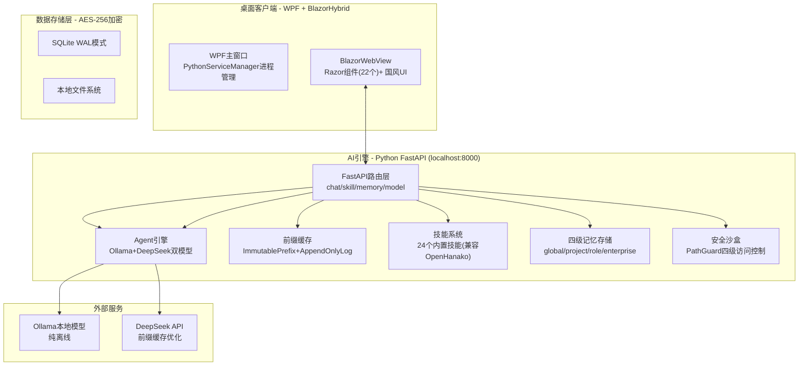

## 用户需求

用户提供完整的"智工助手·企业版 v2.0"PRD，并补充以下关键信息：

### 参考项目（已深入分析，只读参考）

1. **OpenHanako** - Electron+React+Zustand桌面AI助理，核心可移植：三栏式桌面布局、PathGuard四级访问控制、JSON技能包格式、书桌心跳巡检、多Agent角色路由
2. **Hermes-Agent** - Python CLI Agent，核心可移植：Curator自学习闭环、子Agent并行调度、Context Engine提示缓存感知、Background Review优化机制
3. **DeepSeek-Reasonix** - TypeScript+Rust TUI，核心可移植：ImmutablePrefix+AppendOnlyLog缓存结构、SEARCH/REPLACE编辑+审核门、闪速优先成本策略、工具调用修复管道

### 人员分布（共17人）

- 工程师14名：软件工程师、电气工程师、机械工程师、实施工程师、仿真工程师
- 文员1名、会计1名、项目经理1名（新增）

### 必须使用的技能

- `karpathy-guidelines` - 全程代码质量指导
- `multi-agent-scheduler` - 复杂任务协调调度

### 两阶段交付

- 第一阶段：项目立项Word大纲 + 24个核心技能（工程师8/文员8/会计8）交互流程图
- 第二阶段：WPF + Blazor Hybrid (WPF+WebView2) + Python FastAPI 完整项目骨架（可编译运行）

## 产品概述

专为军工非标自动化企业打造的本地化、多角色、自学习、高安全桌面AI助理系统。基于WPF+Blazor Hybrid+Python FastAPI技术栈，深度整合三大开源Agent框架核心优势，覆盖工程师（含5个子类型）、文员、会计、项目经理四大岗位。所有数据100%本地存储，AES-256加密，支持纯离线运行。

## 核心功能

### 通用功能（所有角色共用）

- 智能聊天系统：多轮对话、气泡消息、代码块/表格/图片渲染、多会话分组、快捷指令"/"、SEARCH/REPLACE编辑模式
- 自学习记忆系统：四级记忆（全局/项目/角色/企业）、记忆压缩、跨会话检索、用户建模
- "文房"异步协作空间：文件拖拽上传/解析/预览、写笺便签、文件监控、版本管理
- 多模型管理：云端(DeepSeek/Qwen/GLM)+本地(Ollama)双模式、一键切换、成本统计、前缀缓存引擎
- 可插拔技能系统：兼容OpenHanako/Hermes/agentskills.io格式、安装/启用/禁用/导出、自学习自动生成
- 子Agent并行任务：任务拆分→并行分发→结果汇总、独立沙盒隔离、任务队列
- 安全与权限：PathGuard四级访问控制+AppContainer系统沙盒、AES-256加密、RBAC角色权限、审计日志

### 角色专属功能

- **工程师**（5个子类型）：工控文档生成、PLC/C#/Python代码辅助、工业计算工具集、项目管理、工业知识库
- **文员**：文档处理、办公自动化、流程管理
- **会计**：发票OCR处理、财务报表生成、税务辅助
- **项目经理**（新增）：项目进度跟踪、资源分配、风险看板、团队协作

### 视觉设计

新中式国风：墨黑(#1A1A1A)+中国红(#C8102E)+青黛(#2A5CAA)配色、思源宋体/黑体、水墨晕染/印章盖印/卷轴展开动效、纯中文界面

## 技术栈

| 层级 | 技术选型 | 说明 |
| --- | --- | --- |
| 桌面壳 | WPF (.NET 10) + BlazorWebView | 原生Windows窗口，Blazor Hybrid方案 |
| 前端UI | Blazor Hybrid (Razor) | Razor组件运行于WPF进程，非独立WASM |
| AI引擎 | Python FastAPI | 本地REST API，Ollama+DeepSeek双模型 |
| 通信 | HTTP REST API (localhost:8000) | WPF HttpClient → Python后端 |
| 数据库 | SQLite + SQLCipher | WAL模式，AES-256透明加密 |
| 本地模型 | Ollama API | 纯离线大模型推理 |
| 云端模型 | DeepSeek/OpenAI兼容 | 前缀缓存优化 |
| 文档 | EPPlus + iTextSharp + ImageSharp + Tesseract | Excel/PDF/图像/OCR |


## 实现策略

### 总体策略：文档先行、架构奠基、逐层构建

基于三个参考项目的深入分析，本项目采用以下策略：

1. **核心架构参考DeepSeek-Reasonix**：前缀缓存引擎(ImmutablePrefix+AppendOnlyLog)、成本控制策略(flash→auto→pro)、SEARCH/REPLACE编辑模式
2. **Agent框架参考Hermes-Agent**：自学习闭环(Curator)、子Agent调度、Background Review优化
3. **UI/交互参考OpenHanako**：三栏式布局、PathGuard沙盒概念、技能包格式兼容
4. 所有模式用.NET 10/C#重新实现，保持设计理念不变

### 关键技术决策

**1. 前缀缓存引擎（移植DeepSeek-Reasonix核心理念）**

- 实现 `ImmutablePrefix`：系统提示词+工具规范+角色定义固定不变，SHA256指纹标识
- 实现 `AppendOnlyLog`：消息严格仅追加，从不重写，自然保持字节前缀
- 实现 `VolatileScratch`：推理内容不发送上游，精炼后注入日志
- 目标：缓存命中率≥95%，Token成本降低≥80%

**2. 成本控制策略（参考DeepSeek-Reasonix闪速优先）**

- 默认Flash模式（本地模型或便宜云端模型）
- 故障信号自动升级（工具调用失败≥3次→切换Pro模型）
- 辅助调用（摘要/压缩/子Agent）固定使用Flash
- 每轮对话颜色标记成本（绿<0.05/黄0.05-0.20/红≥0.20元）

**3. SEARCH/REPLACE代码编辑（移植DeepSeek-Reasonix）**

- 严格字节匹配：`content.indexOf(adaptedSearch)`，无模糊匹配
- 审核门机制：编辑暂存→`/apply`提交→`/discard`放弃→`/undo`回滚
- 自动检测换行风格适配

**4. 自学习引擎（移植Hermes-Agent Curator）**

- Pipeline: analyze→generate→validate→install
- 从对话历史中自动提取可复用技能
- 技能版本管理，支持回滚

**5. PathGuard沙盒安全（移植OpenHanako概念）**

- 四级访问控制枚举：Denied/ReadOnly/ReadWrite/Full
- 文件操作和终端命令经过PathGuard检查
- 每个子Agent运行独立沙盒

### 性能目标

- 应用启动≤3秒
- 消息响应≤1秒（云端）、≤3秒（本地14B）
- 内存占用≤500MB（空闲）、≤1.2GB（运行）
- 72小时无崩溃/内存泄漏

## 架构设计

### 系统架构图



### 目录结构

```
Zingon/
├── IntelliEngineer.sln                    # 解决方案文件
├── README.md                              # 项目说明
├── docs/                                  # 文档产出目录
│   ├── 项目立项大纲.docx                  # 立项Word文档
│   └── flowcharts/                        # 24个技能流程图
│       ├── engineer/                      # 工程师8个
│       ├── clerk/                         # 文员8个
│       └── accountant/                    # 会计8个
├── src/
│   ├── IntelliEngineer.Shared/            # .NET共享类库
│   │   ├── IntelliEngineer.Shared.csproj
│   │   ├── Models/                        # ChatModels/SkillModels/MemoryModels/UserModels/FileModels
│   │   ├── Enums/                         # UserRole/SkillStatus/PermissionLevel
│   │   └── DTOs/                          # ChatRequest/ChatResponse/SkillExecuteRequest
│   ├── IntelliEngineer.Desktop/            # WPF + BlazorHybrid 桌面壳
│   │   ├── IntelliEngineer.Desktop.csproj
│   │   ├── App.xaml / App.xaml.cs          # WPF Application入口
│   │   ├── MainWindow.xaml/.cs            # WPF窗口→托管BlazorWebView
│   │   ├── RouterComponent.razor          # Blazor根路由组件
│   │   ├── PythonServiceManager.cs        # Python进程生命周期管理
│   │   ├── wwwroot/css/                   # theme.css/animations.css/app.css
│   │   ├── Components/Layout/             # MainLayout/LeftSidebar/RightPanel/TopBar
│   │   ├── Components/Chat/               # ChatWindow/MessageBubble/ChatInput/SessionList/StreamingText
│   │   ├── Components/Study/              # StudySpace/FileGrid
│   │   ├── Components/Skills/             # SkillPanel/SkillCard
│   │   ├── Components/Models/             # ModelSelector
│   │   ├── Components/Settings/           # SettingsPage/General/Security/About
│   │   ├── Components/Shared/             # ChineseButton/InkLoading/ScrollTransition/RoleBadge
│   │   └── Services/                      # ApiClient/ChatService/ThemeService/StateContainer
│   └── IntelliEngineer.AIService/         # Python FastAPI AI引擎
│       ├── main.py                        # FastAPI入口（localhost:8000）
│       ├── requirements.txt               # Python依赖
│       ├── config.py                      # 配置管理
│       ├── api/                           # chat/skill/memory/model路由
│       └── services/                      # Agent/prefix_cache/skill_manager/memory_store/sandbox
```

## 关键代码结构

### UserRole枚举（更新为四角色+工程师子类型）

```
public enum UserRole
{
    Engineer = 1,       // 工程师（含5个子类型）
    Clerk = 2,          // 文员
    Accountant = 3,     // 会计
    ProjectManager = 4  // 项目经理（新增）
}

public enum EngineerSubType
{
    Software = 1,       // 软件工程师
    Electrical = 2,     // 电气工程师
    Mechanical = 3,     // 机械工程师
    Implementation = 4, // 实施工程师
    Simulation = 5      // 仿真工程师
}
```

### 前缀缓存引擎（移植DeepSeek-Reasonix）

```
public interface IPrefixCacheService
{
    Task<CacheResult> CheckCacheAsync(string sessionId, string promptPrefix);
    Task UpdateCacheAsync(string sessionId, string fullPrompt, int tokenCount);
    CacheStats GetStats(string sessionId);
    Task CleanupAsync(TimeSpan maxAge);
}

public class ImmutablePrefix
{
    public string SystemPrompt { get; }      // 系统提示词+工具规范
    public string Fingerprint { get; }       // SHA256指纹
    public int CachedTokenCount { get; }     // 已缓存的Token数
}
```

### PathGuard四级访问控制（移植OpenHanako）

```
public enum PathAccessLevel { Denied, ReadOnly, ReadWrite, Full }

public interface IPathGuard
{
    PathAccessLevel CheckPathAccess(string requestedPath, UserRole role);
    bool CanExecuteCommand(string command, UserRole role);
}
```

## 设计风格：新中式国风

以"墨韵书香"为核心理念，将书法、印章、卷轴等传统元素以极其克制的方式融入UI，确保军工企业使用场景的专业严肃性。

### 三栏式主布局

- **左侧边栏（240px）**：墨黑(#1A1A1A)背景，角色切换+会话列表。角色图标采用印章造型，选中态中国红
- **中间主区域（自适应）**：玉白(#FFFFFF)背景，聊天/文房/技能核心工作区
- **右侧详情栏（280px）**：会话信息+记忆卡片+文件预览，卡片带回纹装饰边框

### 关键页面

- **聊天界面**：用户消息浅灰底右对齐，AI消息纯白底+回纹边框左对齐。输入框卷轴造型，发送按钮印章造型（中国红底白色"发"字）。加载态水墨晕染动画
- **文房空间**：文件以卷轴图标展示，悬浮上浮阴影。顶部"写笺"按钮（毛笔图标），点击弹出纸质便签
- **技能面板**：竖排书签式卡片，顶部角色色带（工程师青黛/文员竹青/会计赭石/项目经理中国红）。安装中技能卷轴展开动画
- **设置页面**：左侧竖排分类导航，开关按钮"拨子"造型，开启态中国红

### 动效系统（200-300ms，舒缓自然）

- 加载：水墨在宣纸上晕染扩散
- 按钮：印章盖印瞬间（缩放+轻微回弹）
- 页面切换：线装书翻页效果
- 提示消息：墨滴落下

## 必须使用的技能

### multi-agent-scheduler

- 用途：协调两阶段复杂任务的分发执行，管理文档生成与代码开发并行工作流，确保Boss-Worker模式下的任务分解、审查与迭代
- 预期产出：各子任务执行顺序与依赖关系的调度计划，确保并行任务不冲突、串行任务有明确交接

### karpathy-guidelines

- 用途：全过程代码质量指导，确保变更精准、避免过度工程化、保持架构简洁、每处修改可追溯
- 预期产出：符合"精确修改、最小代码、可验证目标"原则的高质量代码

## 按需使用的技能

### docx

- 用途：生成项目立项Word格式大纲文档，包含产品概述、技术架构、开发计划、风险评估等完整章节
- 预期产出：格式规范、章节完整的.docx立项文档

### Impeccable（前端设计工具集）

- 用途：设计新中式国风UI主题系统，配色方案验证、字体层级定义、动效曲线调优、组件视觉规范
- 预期产出：完整国风设计令牌（CSS变量）、组件视觉稿、动效参数

### 前端开发

- 用途：构建Blazor Hybrid前端组件，三栏式布局、聊天界面、文房空间、技能面板（运行于WPF BlazorWebView进程内）
- 预期产出：22个Razor组件+国风CSS主题系统

### 全栈开发

- 用途：搭建Python FastAPI后端架构，Agent引擎、前缀缓存、技能管理、记忆存储、安全沙盒
- 预期产出：可运行的Python AI服务（localhost:8000）

### pdf

- 用途：将24个技能交互流程图导出为PDF格式，便于打印评审
- 预期产出：24个核心技能的PDF流程图文件