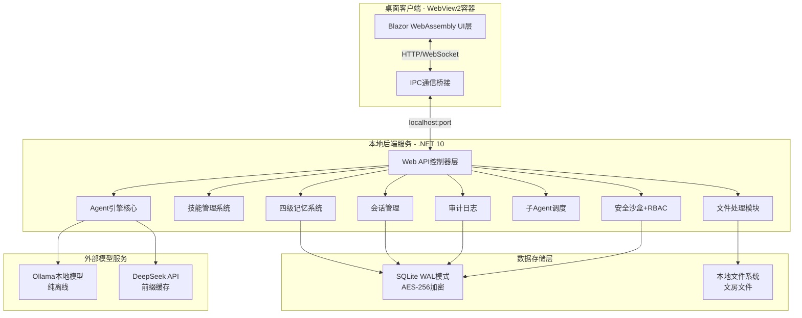
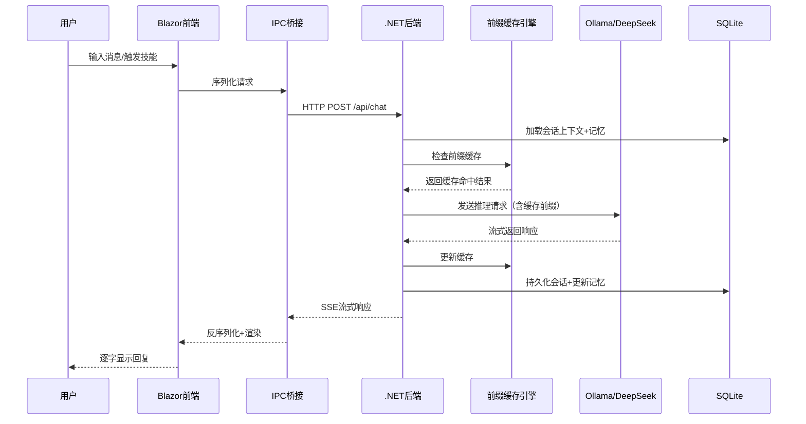

## 用户需求

用户提供了一份完整的"智工助手·企业版 v2.0"PRD文档，并明确如下交付要求：

### 第一阶段：文档产出

- 生成项目立项Word格式大纲文档（含产品概述、技术架构、开发计划、风险评估等章节）
- 生成24个核心技能的详细交互流程图（工程师14个+文员1个+会计1个）

### 第二阶段：完整项目骨架开发

从零搭建 Blazor WebAssembly + .NET 10 + WebView2 桌面应用完整项目骨架，包括：

**前端（Blazor WebAssembly）**：

- 新中式国风主题系统（墨黑、中国红、青黛等配色体系）
- 三栏式布局（左侧导航栏、中间主区域、右侧详情栏）
- 聊天对话界面（气泡式消息、代码块、表格渲染、多会话管理）
- "文房"异步协作空间（文件拖拽上传、写笺便签、文件预览）
- 技能管理界面（安装/启用/禁用/分组）
- 多模型管理面板（云端+本地模型切换、参数配置、成本统计）
- 角色切换系统（工程师/文员/会计三角色）
- 系统设置（通用设置、安全设置、关于）
- 国风动效系统（水墨晕染加载、印章盖印按钮、卷轴展开过渡）

**后端（.NET 10 Web API）**：

- Agent引擎核心（多模型统一调用、DeepSeek前缀缓存集成）
- 技能管理系统（兼容OpenHanako技能包格式）
- 四级记忆系统（全局/项目/角色/企业记忆）
- 会话管理（持久化、历史压缩、全文检索）
- 文件处理模块（Word/Excel/PDF解析、OCR识别）
- 子Agent并行调度系统
- 权限管理（RBAC角色权限控制）
- 双层沙盒安全（PathGuard访问控制+AppContainer系统沙盒）
- 审计日志系统

**WebView2桌面壳**：

- Windows原生窗口（标题栏、系统菜单、托盘图标）
- Blazor-桌面IPC通信桥接
- 自动更新检测

**数据层**：

- SQLite数据库（WAL模式、AES-256加密）
- 本地文件存储（文房文件管理）

## 技术栈

| 层级 | 技术选型 | 版本 | 说明 |
| --- | --- | --- | --- |
| 桌面容器 | WebView2 | 最新稳定版 | 内嵌Edge Chromium，提供原生窗口能力 |
| 前端框架 | Blazor WebAssembly | .NET 10 | C#全栈前端，组件化开发 |
| 后端运行时 | ASP.NET Core Web API | .NET 10 | 高性能REST API服务 |
| 数据库 | SQLite + SQLCipher | 最新 | WAL模式，AES-256透明加密 |
| 本地模型 | Ollama API | 最新 | 纯离线大模型推理 |
| 云端模型 | DeepSeek API / OpenAI兼容 | v1 | 支持前缀缓存的云端推理 |
| Excel | EPPlus | 最新 | .xlsx读写，无COM依赖 |
| PDF | iTextSharp Community | 最新 | PDF生成与解析 |
| 图像 | SixLabors.ImageSharp | 最新 | 跨平台图像处理 |
| OCR | Tesseract .NET | 最新 | 中文发票/文档识别 |


## 实现策略

### 总体策略：分层渐进式交付

项目采用"文档先行、架构奠基、逐层构建"的策略。第一阶段确保需求对齐和交互设计确认；第二阶段先搭建完整可编译运行的最小骨架（包含基础UI和API通信），再逐模块填充业务逻辑，确保每个阶段有可验证的交付物。

### 关键技术决策

**1. 为何选择Blazor WebAssembly而非React/Vue？**

PRD明确要求.NET技术栈，且目标企业已有C#技术储备。Blazor WebAssembly允许前端和后端共享类型定义、验证逻辑和工具类，显著降低重复开发。WebView2作为桌面容器提供比Electron更轻量的解决方案（无需捆绑Node.js和Chromium完整版）。

**2. 前端架构：组件化 + 状态容器模式**

Blazor组件天然支持封装。采用"Smart-Presentational"分层：页面级组件（Smart）通过注入服务管理状态和API调用，展示级组件（Presentational）仅通过参数接收数据并触发回调。状态管理使用`System.Threading.Channels`实现前端事件总线，避免引入第三方状态库的复杂性。

**3. 后端架构：Clean Architecture分层**

```
API层（Controllers）→ 应用层（Services/UseCases）→ 领域层（Domain Models）→ 基础设施层（Repositories/External APIs）
```

所有外部依赖（Ollama、DeepSeek、文件系统）通过接口抽象在基础设施层，核心业务逻辑不依赖任何外部框架。

**4. 性能关键设计：前缀缓存引擎**

参考DeepSeek-Reasonix的前缀缓存机制，在服务端实现会话级别的提示词前缀缓存。对于重复的系统提示词（角色定义、技能描述等），仅首次发送完整内容，后续请求仅发送差异部分。缓存命中率目标≥95%，Token成本降低≥80%。

**5. 安全架构：纵深防御**

- 数据层：SQLCipher AES-256加密所有数据库文件
- 应用层：PathGuard四级路径访问控制（禁止/只读/读写/完全）
- 系统层：Windows AppContainer进程沙盒
- 传输层：HTTPS加密（云端API调用）
- 用户层：bcrypt密码哈希，RBAC角色权限

## 架构设计

### 系统架构图



### 数据流



## 目录结构

```
Zingon/
├── IntelliEngineer.sln                    # [NEW] 解决方案文件
├── README.md                              # [NEW] 项目说明文档
├── docs/                                  # [NEW] 文档目录
│   ├── 项目立项大纲.docx                  # [NEW] 第一阶段：项目立项Word文档
│   └── flowcharts/                        # [NEW] 第一阶段：技能交互流程图
│       ├── engineer/                      # 工程师8个技能流程图
│       ├── clerk/                         # 文员8个技能流程图
│       └── accountant/                    # 会计8个技能流程图
├── src/
│   ├── IntelliEngineer.Shared/            # [NEW] 共享类库项目
│   │   ├── IntelliEngineer.Shared.csproj
│   │   ├── Models/                        # 共享数据模型（消息、会话、技能、记忆等）
│   │   │   ├── ChatModels.cs              # 消息、会话、角色定义
│   │   │   ├── SkillModels.cs             # 技能包、技能实例模型
│   │   │   ├── MemoryModels.cs            # 四级记忆数据结构
│   │   │   ├── UserModels.cs              # 用户、角色、权限模型
│   │   │   └── FileModels.cs              # 文房文件元数据模型
│   │   ├── Enums/                         # 共享枚举定义
│   │   │   ├── UserRole.cs                # 工程师/文员/会计角色枚举
│   │   │   ├── SkillStatus.cs             # 技能状态枚举
│   │   │   └── PermissionLevel.cs         # PathGuard权限级别枚举
│   │   └── DTOs/                          # API数据传输对象
│   │       ├── ChatRequest.cs
│   │       ├── ChatResponse.cs
│   │       └── SkillExecuteRequest.cs
│   ├── IntelliEngineer.Server/            # [NEW] .NET 10后端API项目
│   │   ├── IntelliEngineer.Server.csproj
│   │   ├── Program.cs                     # 应用入口：服务注册、中间件配置
│   │   ├── appsettings.json               # 配置文件（模型API密钥、数据库路径等）
│   │   ├── Controllers/                   # API控制器层
│   │   │   ├── ChatController.cs          # 聊天对话API（流式响应SSE）
│   │   │   ├── SkillController.cs         # 技能管理API（CRUD+安装+导出）
│   │   │   ├── MemoryController.cs        # 记忆管理API
│   │   │   ├── FileController.cs          # 文房文件管理API
│   │   │   ├── ModelController.cs         # 模型管理与切换API
│   │   │   ├── UserController.cs          # 用户与权限管理API
│   │   │   └── AuditController.cs         # 审计日志查询API
│   │   ├── Services/                      # 业务服务层
│   │   │   ├── AgentService.cs            # Agent核心引擎（多模型调用协调）
│   │   │   ├── PrefixCacheService.cs      # DeepSeek前缀缓存引擎
│   │   │   ├── SkillService.cs            # 技能生命周期管理
│   │   │   ├── SkillExecutorService.cs    # 技能执行引擎
│   │   │   ├── MemoryService.cs           # 四级记忆CRUD+压缩
│   │   │   ├── SessionService.cs          # 会话持久化与检索
│   │   │   ├── SubAgentScheduler.cs       # 子Agent任务调度器
│   │   │   ├── FileProcessorService.cs    # 文件解析（Word/Excel/PDF/OCR）
│   │   │   ├── ModelRouterService.cs      # 模型路由（云端vs本地自动选择）
│   │   │   ├── SecurityService.cs         # 沙盒权限校验
│   │   │   └── AuditService.cs            # 审计日志记录
│   │   ├── Infrastructure/                # 基础设施层
│   │   │   ├── Data/                      # 数据库上下文与迁移
│   │   │   │   ├── AppDbContext.cs         # EF Core数据库上下文
│   │   │   │   └── Migrations/            # 数据库迁移文件
│   │   │   ├── External/                  # 外部服务适配器
│   │   │   │   ├── OllamaClient.cs        # Ollama API客户端
│   │   │   │   ├── DeepSeekClient.cs      # DeepSeek API客户端
│   │   │   │   └── OpenAIClientBase.cs    # OpenAI兼容接口基类
│   │   │   ├── Sandbox/                   # 安全沙盒实现
│   │   │   │   ├── PathGuard.cs           # PathGuard四级访问控制
│   │   │   │   └── AppContainerManager.cs # Windows AppContainer管理
│   │   │   └── Encryption/                # 加密工具
│   │   │       └── AesEncryptionHelper.cs # AES-256数据库加密
│   │   └── Middleware/                    # HTTP中间件
│   │       ├── AuditLogMiddleware.cs      # 请求审计中间件
│   │       └── SecurityMiddleware.cs      # 安全头注入中间件
│   ├── IntelliEngineer.Client/            # [NEW] Blazor WebAssembly前端项目
│   │   ├── IntelliEngineer.Client.csproj
│   │   ├── Program.cs                     # Blazor WASM入口：服务注册
│   │   ├── App.razor                      # 根组件：路由+布局
│   │   ├── wwwroot/                       # 静态资源
│   │   │   ├── index.html                 # HTML宿主页面
│   │   │   ├── css/
│   │   │   │   ├── app.css                # 主样式表
│   │   │   │   ├── theme.css              # 新中式国风主题变量（配色/字体/动效）
│   │   │   │   └── animations.css         # 国风动效（水墨晕染/印章/卷轴）
│   │   │   ├── fonts/                     # 嵌入字体
│   │   │   │   ├── SourceHanSerif-Bold.woff2     # 思源宋体粗体
│   │   │   │   ├── SourceHanSerif-Regular.woff2  # 思源宋体常规
│   │   │   │   └── SourceHanSans-Regular.woff2   # 思源黑体常规
│   │   │   └── images/                    # 图标与装饰元素
│   │   │       └── icons/                 # 国风线性图标
│   │   ├── Components/                    # Blazor组件
│   │   │   ├── Layout/                    # 布局组件
│   │   │   │   ├── MainLayout.razor       # 三栏式主布局
│   │   │   │   ├── LeftSidebar.razor      # 左侧导航栏（角色切换+会话列表）
│   │   │   │   ├── RightPanel.razor       # 右侧详情栏（会话信息+记忆+预览）
│   │   │   │   └── TopBar.razor           # 顶部工具栏
│   │   │   ├── Chat/                      # 聊天相关组件
│   │   │   │   ├── ChatWindow.razor       # 聊天主窗口（消息列表+输入区）
│   │   │   │   ├── MessageBubble.razor    # 消息气泡（支持代码块/表格/图片）
│   │   │   │   ├── ChatInput.razor        # 输入区域（快捷指令"/"+附件上传）
│   │   │   │   ├── SessionList.razor      # 会话列表
│   │   │   │   └── StreamingText.razor    # 流式文本逐字渲染组件
│   │   │   ├── Study/                      # "文房"模块组件
│   │   │   │   ├── StudySpace.razor       # 文房主界面
│   │   │   │   ├── FileGrid.razor         # 文件网格视图
│   │   │   │   ├── FilePreview.razor      # 文件预览面板
│   │   │   │   └── WriteNote.razor        # 写笺便签组件
│   │   │   ├── Skills/                    # 技能管理组件
│   │   │   │   ├── SkillPanel.razor       # 技能面板主界面
│   │   │   │   ├── SkillCard.razor        # 技能卡片（显示名称/描述/状态）
│   │   │   │   └── SkillInstallDialog.razor # 技能安装对话框
│   │   │   ├── Models/                    # 模型管理组件
│   │   │   │   ├── ModelSelector.razor    # 模型选择下拉
│   │   │   │   └── ModelConfigPanel.razor # 模型参数配置面板
│   │   │   ├── Settings/                  # 系统设置组件
│   │   │   │   ├── SettingsPage.razor     # 设置主页
│   │   │   │   ├── GeneralSettings.razor  # 通用设置
│   │   │   │   ├── SecuritySettings.razor # 安全设置
│   │   │   │   └── AboutPage.razor        # 关于页面
│   │   │   └── Shared/                    # 共享UI组件
│   │   │       ├── ChineseButton.razor    # 国风按钮（印章盖印动效）
│   │   │       ├── InkLoading.razor       # 水墨晕染加载动画
│   │   │       ├── ScrollTransition.razor # 卷轴展开过渡动画
│   │   │       └── RoleBadge.razor        # 角色标识徽章
│   │   ├── Services/                      # 前端服务层
│   │   │   ├── ApiClient.cs               # HTTP客户端（调用后端API）
│   │   │   ├── ChatService.cs             # 聊天业务逻辑
│   │   │   ├── ThemeService.cs            # 主题切换服务
│   │   │   └── StateContainer.cs          # 全局状态容器
│   │   └── Hooks/                         # 自定义Hook（生命周期管理）
│   │       └── UseStreamingResponse.cs    # SSE流式响应处理Hook
│   └── IntelliEngineer.Desktop/           # [NEW] WebView2桌面壳项目
│       ├── IntelliEngineer.Desktop.csproj
│       ├── Program.cs                     # 桌面应用入口
│       ├── MainForm.cs                    # Windows主窗口（WebView2宿主）
│       ├── IpcBridge.cs                   # Blazor-桌面IPC通信桥接
│       ├── TrayManager.cs                 # 系统托盘管理
│       ├── AutoUpdater.cs                 # 自动更新检测
│       └── Resources/                     # 桌面资源
│           └── app.ico                    # 应用图标
```

## 关键代码结构

### 核心数据模型（IntelliEngineer.Shared/Models/）

```
// ChatModels.cs - 聊天核心模型
public class ChatMessage
{
    public string Id { get; set; }
    public string SessionId { get; set; }
    public UserRole Role { get; set; }        // 角色标识
    public string Content { get; set; }
    public MessageType Type { get; set; }      // Text/Code/Table/Image/File
    public DateTime CreatedAt { get; set; }
    public bool IsEdited { get; set; }
    public string? ParentMessageId { get; set; } // 编辑链追溯
}

public class ChatSession
{
    public string Id { get; set; }
    public string Title { get; set; }
    public UserRole AssignedRole { get; set; }
    public string ModelId { get; set; }
    public List<ChatMessage> Messages { get; set; }
    public DateTime CreatedAt { get; set; }
    public DateTime LastActiveAt { get; set; }
    public string? GroupId { get; set; }       // 会话分组
}

// SkillModels.cs - 技能模型（兼容OpenHanako格式）
public class SkillPackage
{
    public string Id { get; set; }
    public string Name { get; set; }           // 中文名称
    public string Description { get; set; }    // 中文描述
    public string Version { get; set; }
    public UserRole TargetRole { get; set; }   // 目标角色
    public SkillFormat Format { get; set; }    // OpenHanako/Hermes/Standard
    public string SystemPrompt { get; set; }   // 技能系统提示词
    public List<string> AllowedTools { get; set; }
    public bool IsAutoGenerated { get; set; }  // 是否自学习生成
}

// MemoryModels.cs - 四级记忆模型
public class MemoryEntry
{
    public string Id { get; set; }
    public MemoryLevel Level { get; set; }     // Global/Project/Role/Enterprise
    public string Key { get; set; }
    public string Value { get; set; }
    public double Importance { get; set; }     // 重要性评分（用于压缩排序）
    public DateTime CreatedAt { get; set; }
    public DateTime LastAccessedAt { get; set; }
}
```

### 前缀缓存引擎接口

```
// 前缀缓存服务核心接口
public interface IPrefixCacheService
{
    // 检查并返回缓存命中的前缀Token数量
    Task<CacheResult> CheckCacheAsync(string sessionId, string promptPrefix);
    
    // 更新缓存（追加新的前缀Token）
    Task UpdateCacheAsync(string sessionId, string fullPrompt, int tokenCount);
    
    // 获取缓存统计
    CacheStats GetStats(string sessionId);
    
    // 清理过期缓存
    Task CleanupAsync(TimeSpan maxAge);
}
```

### 沙盒权限校验接口

```
// PathGuard四级访问控制
public enum PathAccessLevel { Denied, ReadOnly, ReadWrite, Full }

public interface IPathGuard
{
    PathAccessLevel CheckPathAccess(string requestedPath, UserRole role);
    bool CanExecuteCommand(string command, UserRole role);
    Task<bool> RequestElevationAsync(string operation, string reason);
}
```

## 设计风格：新中式国风

整体风格融合中国传统美学与现代桌面应用的简约专业感。以"墨韵书香"为核心理念，将书法、印章、卷轴等传统元素以极其克制的方式融入UI，避免过度装饰，确保军工企业使用场景的专业严肃性。

### 三栏式主布局

**左侧边栏（240px）**：深色背景（墨黑 #1A1A1A），承载角色切换、会话列表和功能导航。角色切换使用印章造型的圆形图标，选中状态呈现中国红。会话列表项以书法笔画般的细线分隔。

**中间主区域（自适应）**：玉白色背景，聊天窗口为绝对核心。消息气泡采用圆角矩形设计，用户消息右对齐（浅灰底色），AI回复左对齐（纯白底色+细回纹边框）。代码块采用深色背景+Consolas字体，左上角有"代码"标签。

**右侧详情栏（280px）**：显示当前会话相关信息、记忆卡片、文件预览。卡片设计加入细线条回纹装饰边框（颜色为中国红或青黛的淡色版本）。

### 关键页面设计

**聊天界面**：底部输入框采用中国传统卷轴造型（两端微微卷起），输入框内placeholder文字为"请输入您的问题或指令..."。发送按钮为印章造型（圆形，中国红底色，白色"发"字）。加载状态使用水墨晕染扩散动画。

**文房空间**：模拟古代书房桌面，文件以卷轴图标展示，支持拖拽排列。顶部有"写笺"按钮（毛笔图标），点击后弹出纸质便签。文件悬浮时呈现微微上浮阴影效果。

**技能面板**：技能卡片采用竖排版式，类似古代书签。卡片顶部有角色标识色带（工程师青黛、文员竹青、会计赭石）。安装中的技能显示卷轴展开动画。

**设置页面**：左侧分类导航（竖排），右侧内容区。开关按钮使用传统"拨子"造型，开启时呈现中国红色。

### 动效系统

所有动效时长200-300ms，舒缓自然。页面切换使用仿线装书翻页效果。按钮点击呈现印章盖印瞬间（缩放+轻微回弹）。加载使用水墨在宣纸上晕染扩散。提示消息从上方墨滴般落下。

## 本计划使用的Agent扩展

### Skill

- **docx**
- 用途：生成项目立项Word格式大纲文档，包含产品概述、技术架构、开发计划、风险评估等完整章节
- 预期产出：一份格式规范、章节完整的 .docx 立项文档，可直接用于项目审批

- **Impeccable（前端设计工具集）**
- 用途：设计新中式国风UI主题系统，包括配色方案验证、字体层级定义、动效曲线调优、组件视觉规范制定
- 预期产出：完整的国风设计令牌（CSS变量）、组件视觉稿、动效参数定义

- **前端开发**
- 用途：构建Blazor WebAssembly前端项目，实现三栏式布局、聊天界面、文房空间、技能面板等核心前端组件
- 预期产出：可运行的Blazor WASM前端，包含完整的国风UI组件库和页面

- **全栈开发**
- 用途：设计.NET 10后端API架构，搭建分层服务结构，实现Agent引擎、技能系统、记忆系统等核心服务
- 预期产出：可编译运行的后端API项目，包含完整的服务注册、中间件管道和数据库上下文

- **karpathy-guidelines**
- 用途：全程代码质量指导，确保变更精准、避免过度工程化、保持架构简洁
- 预期产出：符合"精确修改、最小代码、可验证目标"原则的高质量代码

- **multi-agent-scheduler**
- 用途：协调两阶段复杂任务的分发与执行，管理文档生成和代码开发两条并行工作流
- 预期产出：任务调度计划、各子任务执行顺序与依赖关系

- **pdf**
- 用途：将部分技能流程图导出为PDF格式，便于打印评审
- 预期产出：24个核心技能的PDF流程图文件